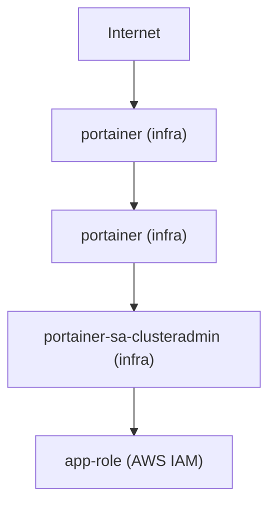
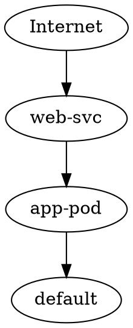

# DevOps-Proxy Architecture

DevOps-Proxy (`dp`) is an extensible DevOps execution and analysis engine.

It is NOT an AI wrapper.

It is a deterministic DevOps auditing engine, optionally enhanced by AI summarization.

## Core Principles

1. Offline-first — all audits run without internet access (AWS SDK only, no SaaS dependency).
2. Deterministic rule engine — findings are produced by code, not by an LLM.
3. AI used only for summarization and reasoning (not implemented yet — post-MVP).
4. Engine independent from CLI — `internal/engine` has zero knowledge of cobra or output formatting.
5. SaaS compatibility from day one — all output is structured JSON; CLI is a thin rendering layer.
6. Multi-profile AWS support — `--profile`, `--all-profiles`, region discovery.
7. JSON internally, formatted output via CLI (`--output table|json`, `--summary`).

## Architecture Layers

```
┌─────────────────────────────────────────────────────────────────┐
│  cmd/dp                        CLI (cobra)                       │
│  - flags, wiring, output rendering                               │
│  - NO business logic                                             │
└───────────────────────┬─────────────────────────────────────────┘
                        │
┌───────────────────────▼─────────────────────────────────────────┐
│  internal/engine               Orchestration                     │
│                                                                  │
│  AWS engines:                  Kubernetes engine:                │
│  - AWSCostEngine               - KubernetesEngine                │
│  - AWSSecurityEngine             + correlateRiskChains (6 chains)│
│  - AWSDataProtectionEngine       + buildAttackPaths (5 paths)    │
│  - AllAWSDomainsEngine           + buildRiskChains               │
│                                  + namespace classification       │
│  RunAudit(ctx, Options) → *AuditReport                           │
└──────┬──────────────────────────────┬───────────────────────────┘
       │                              │
┌──────▼──────────────┐   ┌───────────▼────────────────────────────┐
│  internal/rulepacks │   │  internal/providers/                    │
│                     │   │                                         │
│  aws_cost (8 rules) │   │  aws/common/  AWSClientProvider         │
│  aws_security       │   │  aws/cost/    CostCollector             │
│    (8 rules)        │   │  aws/security/ SecurityCollector        │
│  aws_dataprotection │   │  aws/eks/     DefaultEKSCollector       │
│    (3 rules)        │   │  kubernetes/  KubeClientProvider        │
│  kubernetes_core    │   │               CollectClusterData        │
│    (16 rules)       │   │                                         │
│  kubernetes_eks     │   └─────────────────────────────────────────┘
│    (6 rules)        │
└──────┬──────────────┘
       │
┌──────▼──────────────────────────────────────────────────────────┐
│  internal/rules         Rule interfaces + registry               │
│  internal/models        findings.go / aws.go / kubernetes.go     │
│  internal/policy        dp.yaml loading + ApplyPolicy            │
└─────────────────────────────────────────────────────────────────┘
```

## Implemented Commands

| Command | Engine | Rules | Collectors |
|---------|--------|-------|------------|
| `dp aws audit cost` | AWSCostEngine | 8 | CostCollector (EC2/EBS/NAT/RDS/ELB+CW + Cost Explorer + SP coverage) |
| `dp aws audit security` | AWSSecurityEngine | 8 | SecurityCollector (IAM/root/S3/SGs + CloudTrail + GuardDuty + Config) |
| `dp aws audit dataprotection` | AWSDataProtectionEngine | 3 | CostCollector (EBS/RDS encrypted fields) + SecurityCollector (S3) |
| `dp aws audit --all` | AllAWSDomainsEngine | 19 | All three domain engines; cross-domain merge + per-domain enforcement |
| `dp kubernetes audit` | KubernetesEngine | 22 | KubeClientProvider (nodes/namespaces/LimitRanges/pods/SAs) + EKSCollector |
| `dp kubernetes inspect` | — | — | KubeClientProvider (context, API server, nodes, namespaces) |

## Concurrency Model

**Region-level** (inside `CostCollector.CollectAll`):
- `errgroup.WithContext` + semaphore channel (capacity 5)
- One goroutine per region; `sync.Mutex` protects the shared result slice
- Fail-fast: first region error cancels all remaining regions

**Profile-level** (inside `AWSCostEngine.runAllProfiles`):
- `errgroup.WithContext` + semaphore channel (capacity 3)
- One goroutine per profile; `sync.Mutex` protects shared findings/regions/allCostSummaries
- CostSummaries aggregated via `aggregateCostSummaries` (sum TotalCostUSD, merge ServiceBreakdown)
- `buildReport` (merge → policy → sort) runs sequentially after all goroutines complete

## Rule Engine Design

- Rules implement a single `Evaluate(RuleContext) []Finding` interface.
- A `RuleRegistry` holds all registered rules; `EvaluateAll` iterates them.
- Rule packs (`internal/rulepacks/`) bundle related rules and expose `New() []rules.Rule`.
- Engines register the pack, not individual rules — extensible without changing engine code.
- Rules never call AWS SDK, LLM, or CLI.

## Policy Layer

- Optional `dp.yaml` file configures per-rule overrides (disable, severity override, savings threshold).
- `policy.ApplyPolicy(findings, auditType, cfg)` filters/modifies findings post-evaluation.
- All engines apply policy after `mergeFindings`, before `sortFindings`.
- Auto-detected from `./dp.yaml`; overridden with `--policy=<path>`.

## Finding Lifecycle

```
CollectAll → raw data
  → EvaluateAll → []Finding (raw, may have duplicates per resource)
  → mergeFindings → []Finding (one per ResourceID+Region; savings summed, severity max)
  → annotateNamespaceType → stamp namespace_type=system|workload|cluster on each finding
  → [excludeSystemFindings] → optional: remove system-namespace findings
  → correlateRiskChains → annotate risk_chain_score + risk_chain_reason on participating findings
  → buildAttackPaths → []AttackPath (multi-layer compound paths; cluster + namespace scoped)
  → [filterByMinRiskScore] → optional: retain only findings at or above min score
  → ApplyPolicy → []Finding (filtered by dp.yaml rules)
  → sortFindings → []Finding (CRITICAL→HIGH→MEDIUM→LOW→INFO, savings desc within tier)
  → AuditReport (JSON)
```

## Output Pipeline

```
Engine.RunAudit → *models.AuditReport
  │
  ├── --file=<path>    → write full JSON report to file
  ├── --summary        → printSummary (severity breakdown + top findings)
  ├── --output=json    → encodeJSON (indented JSON to stdout)
  ├── --color          → ANSI severity coloring in table output (opt-in, CI-safe default)
  └── default          → renderTable (colored bool)
```

Exit code 1 is returned unconditionally when any CRITICAL or HIGH finding exists.

## Kubernetes Audit: Correlation Engine

The correlation engine lives in `internal/engine/kubernetes_correlation.go` and runs as a post-merge, pre-policy pass on the Kubernetes finding set.

### Phase Overview

| Phase | Feature | File |
|-------|---------|------|
| 3C | Namespace classification (system/workload/cluster) | kubernetes.go |
| 4A | Risk chains 1–3 (scores 50/60/80) | kubernetes_correlation.go |
| 4B | `Summary.RiskScore` | kubernetes.go |
| 4C | `--min-risk-score` filtering | kubernetes_correlation.go |
| 5C | Risk chains 4–6 (scores 90/85/95) | kubernetes_correlation.go |
| 5D | `--show-risk-chains`; `buildRiskChains` | kubernetes_correlation.go |
| 6 | `buildAttackPaths` — PATH 1/2/3 | kubernetes_correlation.go |
| 6.1 | Namespace-scoped dual-index for attack paths | kubernetes_correlation.go |
| 6.2 | Strict rule-scoped filtering (primary-only collection) | kubernetes_correlation.go |
| 7A | PATH 4 — EKS Control Plane Exposure | kubernetes_correlation.go |
| 7B | PATH 5 — Cross-Cloud Identity Escalation | kubernetes_correlation.go |
| 8 | `--explain-path <score>` — attack path explanation renderer | render/explain.go |
| 9 | `--min-attack-score <int>` — post-correlation attack path filter | render/min_attack_score.go |
| 10 | `--attack-graph` — graph export (Mermaid / Graphviz); `BuildAttackGraph` (strict linear chain) | render/graph.go |
| 10.1 | Fix edge explosion — strict one-representative-per-layer linear chain | render/graph.go |
| 10.2 | Layered fan-out graph — all entities per layer; single-parent rule prevents M×N explosion | render/graph.go |
| 10.3 | Structural graph — topology-aware edges via Service selector→Pod labels and Pod→SA name; `annotateStructuralTopology` in engine; no heuristics | render/graph.go, engine/kubernetes.go |
| 10.4 | Workload-collapsed graph — pods replaced by parent workload nodes (Deployment/StatefulSet/…); ownerReferences resolved in collector; multiple pods of same workload → single node | render/graph.go, collector.go, engine/kubernetes.go |
| 11 | IRSA Identity Bridge — `ServiceAccount → IAMRole` edge when SA has `eks.amazonaws.com/role-arn` annotation; `extractRoleName` ARN parser; `iam_role_arn` metadata stamped by engine | render/graph.go, engine/kubernetes.go, collector.go |

### Namespace Classification

Every finding is stamped with `Metadata["namespace_type"]`:

| Value | When |
|-------|------|
| `"system"` | Namespace is `kube-system`, `kube-public`, or `kube-node-lease` |
| `"workload"` | Non-empty namespace not in system set |
| `"cluster"` | No namespace (nodes, EKS rules, cluster-level rules) |

`resolveNamespaceForFinding(f)` extracts the namespace string:
1. `ResourceType == K8S_NAMESPACE` → `ResourceID`
2. `Metadata["namespace"].(string)`
3. `""` (cluster-scoped)

### Risk Chain Correlation

`correlateRiskChains(findings)` annotates findings participating in compound risk patterns. When multiple chains apply, the highest score wins. Severity and sort order are never changed.

| Chain | Score | Scope | Condition | Reason |
|-------|-------|-------|-----------|--------|
| 6 | 95 | global | `EKS_OIDC_PROVIDER_NOT_ASSOCIATED` + any HIGH finding | "Cluster lacks OIDC provider and has high-risk workload findings." |
| 4 | 90 | global | `EKS_NODE_ROLE_OVERPERMISSIVE` + `K8S_SERVICE_PUBLIC_LOADBALANCER` | "Public service exposed in cluster with over-permissive node IAM role." |
| 5 | 85 | namespace | `EKS_SERVICEACCOUNT_NO_IRSA` + `K8S_DEFAULT_SERVICEACCOUNT_USED` | "Default service account used without IRSA." |
| 1 | 80 | namespace | `K8S_SERVICE_PUBLIC_LOADBALANCER` + (`K8S_POD_RUN_AS_ROOT` OR `K8S_POD_CAP_SYS_ADMIN`) | "Public service exposes privileged workload" |
| 2 | 60 | namespace | `K8S_DEFAULT_SERVICEACCOUNT_USED` + `K8S_SERVICEACCOUNT_TOKEN_AUTOMOUNT` | "Default service account with auto-mounted token" |
| 3 | 50 | global | `K8S_CLUSTER_SINGLE_NODE` + any CRITICAL finding | "Single-node cluster with critical pod security violation" |

### Risk Chain vs Attack Path Distinction

| Aspect | Risk Chain | Attack Path |
|--------|-----------|-------------|
| Scope | Annotates **individual findings** | Describes a **multi-layer attacker journey** |
| Output | `Metadata["risk_chain_score"]` on each finding | `[]AttackPath` in `Summary.AttackPaths` |
| Grouping | Findings sharing same (score, reason) pair | All findings in path grouped under one `AttackPath` |
| RiskScore contribution | Fallback when no attack path fires | Always wins when a path is detected |
| Enabled by | `ShowRiskChains=true` (both) | `ShowRiskChains=true` (both) |

### Attack Path Correlation Flow

`buildAttackPaths(findings)` detects multi-layer compound attack paths using a **dual detection/collection index** design.

#### Dual-Index Design

**Detection index** (expanded — uses `ruleIDsForFinding`):
- `detectNS[namespace][ruleID]` — namespace-scoped findings, expanded to include merged rule IDs from `Metadata["rules"]`
- `detectCluster[ruleID]` — cluster-scoped findings, expanded

Rationale: `mergeFindings` may merge same-resource findings; the relevant rule ID might be a non-primary merged rule. Expanded detection prevents false negatives.

**Collection index** (primary-only — uses `f.RuleID` only):
- `collectNS[namespace][ruleID]=[]findingID`
- `collectCluster[ruleID]=[]findingID`

Rationale: `AttackPath.FindingIDs` must contain only findings directly scoped to the path definition. Only the primary `f.RuleID` is indexed, so unrelated co-located findings never appear.

#### Five Attack Paths

| Path | Score | Scope | Trigger Conditions | Allowed Primary Rule IDs |
|------|-------|-------|-------------------|--------------------------|
| **PATH 1** | **98** | Per-namespace | `K8S_SERVICE_PUBLIC_LOADBALANCER` + (`K8S_POD_RUN_AS_ROOT` OR `K8S_POD_CAP_SYS_ADMIN`) + (`EKS_SERVICEACCOUNT_NO_IRSA` OR `K8S_DEFAULT_SERVICEACCOUNT_USED`); optional cluster: `EKS_NODE_ROLE_OVERPERMISSIVE` | `K8S_SERVICE_PUBLIC_LOADBALANCER`, `K8S_POD_RUN_AS_ROOT`, `K8S_POD_CAP_SYS_ADMIN`, `EKS_SERVICEACCOUNT_NO_IRSA`, `K8S_DEFAULT_SERVICEACCOUNT_USED`, `EKS_NODE_ROLE_OVERPERMISSIVE` |
| **PATH 5** | **96** | Per-namespace | `K8S_SERVICE_PUBLIC_LOADBALANCER` + (`K8S_POD_RUN_AS_ROOT` OR `K8S_POD_CAP_SYS_ADMIN`) + (`EKS_SERVICEACCOUNT_NO_IRSA` OR `K8S_DEFAULT_SERVICEACCOUNT_USED` OR `K8S_SERVICEACCOUNT_TOKEN_AUTOMOUNT`); cluster: (`EKS_NODE_ROLE_OVERPERMISSIVE` OR `EKS_IAM_ROLE_WILDCARD`) | `K8S_SERVICE_PUBLIC_LOADBALANCER`, `K8S_POD_RUN_AS_ROOT`, `K8S_POD_CAP_SYS_ADMIN`, `EKS_SERVICEACCOUNT_NO_IRSA`, `K8S_DEFAULT_SERVICEACCOUNT_USED`, `K8S_SERVICEACCOUNT_TOKEN_AUTOMOUNT`, `EKS_NODE_ROLE_OVERPERMISSIVE`, `EKS_IAM_ROLE_WILDCARD` |
| **PATH 4** | **94** | Cluster | `EKS_PUBLIC_ENDPOINT_ENABLED` + (`EKS_NODE_ROLE_OVERPERMISSIVE` OR `EKS_IAM_ROLE_WILDCARD`) + `EKS_CONTROL_PLANE_LOGGING_DISABLED` | `EKS_PUBLIC_ENDPOINT_ENABLED`, `EKS_NODE_ROLE_OVERPERMISSIVE`, `EKS_IAM_ROLE_WILDCARD`, `EKS_CONTROL_PLANE_LOGGING_DISABLED` |
| **PATH 2** | **92** | Per-namespace | `K8S_DEFAULT_SERVICEACCOUNT_USED` + `K8S_SERVICEACCOUNT_TOKEN_AUTOMOUNT` + `EKS_SERVICEACCOUNT_NO_IRSA`; cluster: `EKS_OIDC_PROVIDER_NOT_ASSOCIATED` | `K8S_DEFAULT_SERVICEACCOUNT_USED`, `K8S_SERVICEACCOUNT_TOKEN_AUTOMOUNT`, `EKS_SERVICEACCOUNT_NO_IRSA`, `EKS_OIDC_PROVIDER_NOT_ASSOCIATED` |
| **PATH 3** | **90** | Cluster | `EKS_ENCRYPTION_DISABLED` + `EKS_CONTROL_PLANE_LOGGING_DISABLED` + `K8S_CLUSTER_SINGLE_NODE` | `EKS_ENCRYPTION_DISABLED`, `EKS_CONTROL_PLANE_LOGGING_DISABLED`, `K8S_CLUSTER_SINGLE_NODE` |

#### Execution Order and Sorting

1. Build detection index (expanded) + collection index (primary-only) from the input findings.
2. Evaluate PATH 1 (per qualifying namespace → N entries at score 98).
3. Evaluate PATH 5 (per qualifying namespace → M entries at score 96).
4. Evaluate PATH 2 (per qualifying namespace → K entries at score 92).
5. Evaluate PATH 3 (cluster-scoped → 0 or 1 entry at score 90).
6. Evaluate PATH 4 (cluster-scoped → 0 or 1 entry at score 94).
7. `sort.Slice` by descending score → final sorted `[]AttackPath`.

#### Scoping Rules

- **Per-namespace paths (PATH 1, PATH 5, PATH 2)**: conditions are evaluated per namespace; one `AttackPath` entry per qualifying namespace; findings from one namespace never contaminate another's path.
- **Cluster-scoped paths (PATH 3, PATH 4)**: all conditions use the cluster detection index; exactly one entry total when triggered; no namespace iteration.
- Cluster-level findings (e.g. `EKS_NODE_ROLE_OVERPERMISSIVE`) appended per PATH 1 and PATH 5 entry from the cluster collection index (deduplicated).

#### RiskScore Hierarchy

```
if any AttackPath detected:
    Summary.RiskScore = max(AttackPath.Score)     # always >= 90
else:
    Summary.RiskScore = max(risk_chain_score)     # 0..95
```

Computed pre-policy, pre-filter so `Summary.RiskScore` always reflects true cluster risk.

## Attack Path Rendering Layer (Phase 8)

`internal/render/explain.go` is a **pure rendering package** — no correlation logic, no scoring, no AWS/Kubernetes API calls. It consumes a pre-computed `[]models.AttackPath` and `[]models.Finding` (from `AuditReport`) and produces human-readable output.

### Functions

| Function | Signature | Description |
|----------|-----------|-------------|
| `FindPathByScore` | `(paths []AttackPath, score int) *AttackPath` | Linear scan; returns pointer to first matching path or nil |
| `RenderAttackPathExplanation` | `(w io.Writer, path AttackPath, findings []Finding)` | Strict-filtered table renderer; groups by `f.RuleID` sorted ascending |
| `WriteExplainJSON` | `(w io.Writer, path *AttackPath, score int) error` | `{"attack_path":{…}}` or `{"error":"…"}` as indented JSON |

### Strict Filtering Guarantee

`RenderAttackPathExplanation` only renders findings whose `Finding.ID` appears in `path.FindingIDs`. Findings present in the report but not referenced by the path are silently excluded. This mirrors the collection-index guarantee from `buildAttackPaths`.

### CLI Wiring (`cmd/dp/commands.go`)

```
--explain-path <score>   (requires --show-risk-chains)
```

- `validateExplainFlags(explainScore, showRiskChains)` — returns error when `explainScore > 0 && !showRiskChains`
- Dispatch executes **after** file write; **before** normal `renderKubernetesAuditOutput`
- Early return after explain output: exit 0, no policy enforcement, no exit-code-1

## Attack Path Post-Processing Filters (Phase 9)

Post-correlation filters that operate on the fully-computed `AuditReport` **before** rendering. They never touch the correlation engine, scoring hierarchy, `Summary.RiskScore`, or `Findings`.

### Execution Order

```
Findings → Correlation → AttackPaths (sorted) → FilterAttackPaths → renderReport → Render
                                  ↑
                            (original unmodified)
```

### `FilterAttackPaths` (`render/min_attack_score.go`)

```go
FilterAttackPaths(paths []models.AttackPath, minScore int) []models.AttackPath
```

- Returns a **new slice** of paths with `Score >= minScore`; input is never mutated
- When `minScore <= 0` returns the original slice without allocation
- Produces the `filteredPaths` used to build `renderReport`

### `renderReport` Pattern

In `RunE`, a shallow copy of `report` is created with filtered attack paths:

```go
renderSummary := report.Summary
renderSummary.AttackPaths = filteredPaths   // filtered copy
renderReport := *report
renderReport.Summary = renderSummary        // original report unchanged
```

`risk_score`, `total_findings`, `findings`, and all other summary fields are preserved in `renderReport`. The original `report` (written to `--file` and used for `--explain-path`) is never modified.

### Flags

| Flag | Default | Constraint | Effect |
|------|---------|-----------|--------|
| `--min-attack-score` | 0 | requires `--show-risk-chains` | filter `renderReport.Summary.AttackPaths` |
| `--explain-path` | 0 | requires `--show-risk-chains` | early-return explain mode |

When `--explain-path` and `--min-attack-score` are both set: `explainBelowThreshold(explainScore, minAttackScore)` guards the explain dispatch — if the requested score falls below the threshold, a "below threshold" message is printed and the command exits 0.

## Attack Path Graph Export (Phase 10)

Graph export renders the fully-computed `AuditSummary.AttackPaths` as a directed graph. It operates **after** all correlation and filtering logic — the engine, scoring, and findings list are never touched.

### Pipeline

```
Findings
 ↓
Correlation Engine
 ↓
Attack Path Generation (sorted by score desc)
 ↓
FilterAttackPaths (--min-attack-score, rendering layer)
 ↓
BuildAttackGraph (render/graph.go)
 ↓
Renderer: RenderMermaidGraph | RenderGraphvizGraph
 ↓
stdout
```

### Graph Model (`render/graph.go`)

| Type | Fields | Description |
|------|--------|-------------|
| `Graph` | `Nodes []GraphNode`, `Edges []GraphEdge` | Top-level graph |
| `GraphNode` | `ID`, `Label`, `Type` | Security entity (Internet, LoadBalancer, Deployment, StatefulSet, DaemonSet, Job, CronJob, ReplicaSet, Pod†, ServiceAccount, IAMRole, Cluster, CloudResource) |
| `GraphEdge` | `From`, `To` | Directional attacker-movement link |

† `Pod` appears only as a fallback node type when no workload metadata is available (Phase 10.4).

### `BuildAttackGraph` (Phase 10.4 — Workload-Collapsed / Topology-Aware)

```go
BuildAttackGraph(summary models.AuditSummary, findings []models.Finding) Graph
```

Edges are built from **real Kubernetes relationships** and pods are **collapsed into their parent workload**:

| Edge | Condition |
|------|-----------|
| `Internet → LoadBalancer` | Always — every LB finding in the path |
| `LoadBalancer → Workload` | Only when `Metadata["service_selector"]` matches `Metadata["pod_labels"]`; edge targets the Workload node (not the individual pod) |
| `Workload → ServiceAccount` | Only when `Metadata["pod_service_account"]` == SA finding's `ResourceID` in the same namespace |
| `Workload → ServiceAccount → IAMRole` | Phase 11: when SA finding carries `iam_role_arn` metadata, an `IAMRole` node is added and a `ServiceAccount → IAMRole` edge is emitted |
| `IAMRole / Cluster / CloudResource` | Node added as context; cluster/cloud-resource nodes have no structural edges |

**Workload collapsing (Phase 10.4)**: pod findings with `workload_kind`/`workload_name` metadata produce a single `{Kind}_{Name}` node. Multiple pods belonging to the same Deployment collapse into one `Deployment_*` node. Node IDs are sanitized with `sanitizeNodeID`. When workload metadata is absent (e.g., no ownerReferences resolved), a `Pod_{resourceID}` fallback node is used.

**Workload owner resolution** (`resolveWorkloadOwner`, `collector.go`): all ReplicaSets are pre-fetched before pod iteration. For each pod:
1. Immediate owner kind is `Deployment`/`StatefulSet`/`DaemonSet`/`Job`/`CronJob` → use directly.
2. Immediate owner is `ReplicaSet` → follow to RS's own owner (typically a Deployment).
3. RS has no known parent → use `ReplicaSet` as workload boundary.
4. No ownerReference → `Pod` (uncontrolled).

**Structural metadata** is stamped by `annotateStructuralTopology` (engine, `kubernetes.go`) after `annotateNamespaceType`:
- `Metadata["pod_labels"]` (`map[string]string`) — for LB selector matching
- `Metadata["pod_service_account"]` (`string`) — for SA edge
- `Metadata["workload_kind"]` (`string`) — for node type (Deployment, StatefulSet, …)
- `Metadata["workload_name"]` (`string`) — for node ID / label
- `Metadata["service_selector"]` (`map[string]string`) — on `K8S_SERVICE` findings
- `Metadata["iam_role_arn"]` (`string`) — Phase 11: on `K8S_SERVICEACCOUNT` findings when the SA has the `eks.amazonaws.com/role-arn` IRSA annotation

**Phase 11 — IRSA Identity Bridge**: when a `K8S_SERVICEACCOUNT` finding carries `iam_role_arn` metadata, `BuildAttackGraph` creates an `IAMRole` node (label: `{roleName} (AWS IAM)`) and emits a `ServiceAccount → IAMRole` edge. The role name is extracted from the ARN via `extractRoleName` (last `/`-delimited segment). Multiple SAs sharing the same IAM role will converge on the same `IAMRole_{roleName}` node via `nodeSet` deduplication.

**Selector matching** (`selectorMatchesPodLabels`): all selector key-value pairs must be present in pod labels; empty/nil selector → false (no spurious edges for selector-less services).

- **Node deduplication**: same workload across multiple pod findings → one `GraphNode`
- **Edge deduplication**: parallel edges between the same pair → one `GraphEdge`
- `sanitizeNodeID`: replaces non-alphanumeric/underscore chars with `_` for valid Mermaid and Graphviz syntax

### Flags

| Flag | Default | Constraint | Effect |
|------|---------|-----------|--------|
| `--attack-graph` | false | requires `--show-risk-chains` | Build graph and print; skip normal table output |
| `--graph-format` | `mermaid` | `mermaid` or `graphviz` | Output format for `--attack-graph` |

`--attack-graph` exits after printing the graph — no policy enforcement, no exit-code-1 logic (graph export is view-only).

### Example Mermaid Output

Workload-collapsed graph with IRSA bridge (Phase 10.4 + Phase 11 — selector, SA name, ownerReferences, and IRSA annotation matched):



Edges exist only when:
- `portainer` Service has `spec.selector: {app: portainer}` and pods have label `app=portainer`
- pods are owned by `Deployment/portainer` (resolved via ownerReferences → ReplicaSet → Deployment)
- pods declare `spec.serviceAccountName: portainer-sa-clusteradmin`
- Multiple replicas of the same Deployment collapse into a single `Deployment_portainer` node
- SA has `eks.amazonaws.com/role-arn: arn:aws:iam::123456789012:role/app-role` (Phase 11 IRSA bridge)

### Example Graphviz Output



## Asset Graph Engine (Phase 11.5)

`internal/graph` is a reusable internal graph engine that models infrastructure
relationships across Kubernetes and AWS resources. It is not yet exposed via CLI
output; it serves as the foundation for attack path reasoning, AI explanations,
drift detection, and future SaaS backend integration.

### Package structure

| File | Purpose |
|------|---------|
| `types.go` | `NodeType`, `EdgeType`, `Node`, `Edge`, `Graph` types |
| `graph.go` | `NewGraph`, `AddNode`, `AddEdge`, `GetNode`, `Neighbors`, `EdgesFrom`, `EdgesTo`, `HasEdge` |
| `builder.go` | `BuildAssetGraph(*models.KubernetesClusterData) (*Graph, error)` |
| `graph_test.go` | 5 unit tests |

### Node types
`Internet` · `LoadBalancer` · `Service` · `Workload` · `ServiceAccount` · `IAMRole` · `Cluster` · `Namespace`

### Edge types
| Type | Meaning |
|------|---------|
| `EXPOSES` | Internet → LoadBalancer (publicly reachable) |
| `ROUTES_TO` | LoadBalancer → Workload (selector match) |
| `RUNS_AS` | Workload → ServiceAccount (pod binding) |
| `ASSUMES_ROLE` | ServiceAccount → IAMRole (IRSA annotation) |
| `CONTAINS` | Namespace → Workload / Namespace → ServiceAccount |
| `PART_OF` | Reserved for future inverse containment use |

### Integration

`KubernetesEngine.RunAudit` calls `graph.BuildAssetGraph(k8sData)` after `convertClusterData`
and stores the result in `EngineContext.AssetGraph`. The graph is accessible to callers via
`engine.AssetGraph()` after `RunAudit` returns.

`BuildAttackGraph` in `internal/render/graph.go` accepts `*graph.Graph` as its third parameter.
When non-nil, the AssetGraph is used as the **source of truth** for edge derivation:
`LoadBalancer→Workload` via `ROUTES_TO` edges, `Workload→ServiceAccount` via `RUNS_AS` edges,
and `ServiceAccount→IAMRole` via `ASSUMES_ROLE` edges. When nil, the legacy finding-metadata
approach is used (identical output when the AssetGraph is built from the same cluster data).

Node IDs in the AssetGraph use the same `sanitizeID` logic as `internal/render/graph.go`,
ensuring consistent cross-package ID matching without shared state.

### Phase 11.5 in the Phase Overview table

| Phase | Description | Files |
|-------|-------------|-------|
| 11.5 | Internal Asset Graph engine — `NodeType`/`EdgeType`/`Node`/`Edge`/`Graph`; `BuildAssetGraph`; `EngineContext` stored on `KubernetesEngine`; `BuildAttackGraph` uses AssetGraph as edge source of truth | internal/graph/, engine/kubernetes.go, render/graph.go |

## Engine Layering Philosophy

1. **Providers** — data only; no analysis
2. **Rules** — deterministic evaluation; no I/O
3. **Engine** — orchestrates collect → evaluate → merge → correlate → filter → sort → report
4. **Asset Graph** — topology model built from raw cluster data; feeds render and future AI layers (`internal/graph`)
5. **Render** — pure presentation layer; consumes `AuditReport` + `AssetGraph`; no business logic (`internal/render`)
5. **CLI** — wires flags to engine and render; no business logic
6. **LLM** — optional summarization only; never produces findings

This layering ensures the engine can be tested in isolation, reused as a library, and extended without touching the CLI.

## Future Work

- LLM summarization: findings → human-readable report (`internal/llm` stub ready)
- Terraform plan analysis
- Azure provider module
- GCP provider module
- SaaS backend with org-wide aggregation
- Scheduled audits
- Compliance scoring
