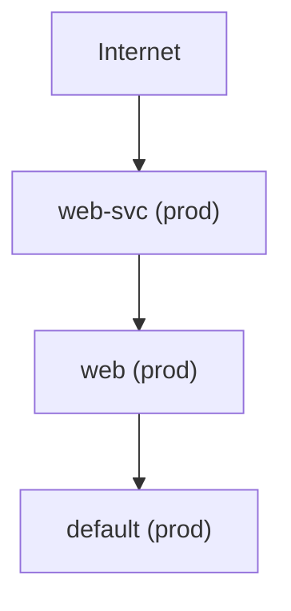

# DevOps Proxy (dp)

A deterministic security and cost audit engine for AWS and Kubernetes — offline-first, rule-based, with optional AI summarisation.

---

## What it does

```
Internet → LoadBalancer → Workload → ServiceAccount → IAM Role
```

`dp` audits your cloud infrastructure by collecting real resource data, running a deterministic rule engine, and surfacing findings with severity rankings and estimated savings. When `--show-risk-chains` is enabled, it traces **multi-layer attack paths** from internet entry points all the way to cloud IAM privilege escalation.

No agent. No SaaS dependency. Runs offline. Outputs JSON or a table.

---

## 60-Second Quickstart

**Install**

```bash
# macOS (Apple Silicon)
curl -L https://github.com/pankaj-dahiya-devops/Devops-proxy/releases/latest/download/dp_<version>_macOS_arm64.tar.gz | tar xz
chmod +x dp && sudo mv dp /usr/local/bin/

# From source (Go 1.22+)
git clone https://github.com/pankaj-dahiya-devops/Devops-proxy.git
cd Devops-proxy && go build -o dp ./cmd/dp
```

**Verify environment**

```bash
dp doctor
```

**Run your first audits**

```bash
# AWS: cost + security + data protection in one shot
dp aws audit --all --summary

# Kubernetes: governance rules against current cluster
dp kubernetes audit --summary
```

**CI — fail the pipeline on HIGH+ findings**

```bash
dp kubernetes audit --policy ./dp.yaml --exclude-system
echo $?  # 1 if HIGH or CRITICAL findings exist
```

---

## Common Workflows

| Intent | Command | Notes |
|--------|---------|-------|
| Full AWS audit | `dp aws audit --all` | cost + security + dataprotection |
| Save JSON report | `dp aws audit --all --file report.json` | stdout still printed |
| Scope to one region | `dp aws audit cost --region us-east-1` | |
| All AWS profiles | `dp aws audit --all --all-profiles` | parallel fan-out |
| K8s table output | `dp kubernetes audit` | current kubeconfig context |
| K8s JSON output | `dp kubernetes audit --output json` | pure JSON to stdout |
| K8s compact summary | `dp kubernetes audit --summary` | severity counts + top findings |
| Exclude system noise | `dp kubernetes audit --exclude-system` | drops kube-system findings |
| Filter by risk score | `dp kubernetes audit --min-risk-score 80` | only findings in high-score chains |
| Show attack paths | `dp kubernetes audit --show-risk-chains` | groups output by attack path / chain |
| Explain one path | `dp kubernetes audit --show-risk-chains --explain-path 96` | structured breakdown |
| Visualise as graph | `dp kubernetes audit --show-risk-chains --attack-graph` | Mermaid flowchart |
| Graphviz SVG | `dp kubernetes audit --show-risk-chains --attack-graph --graph-format graphviz \| dot -Tsvg > out.svg` | |
| Validate policy file | `dp policy validate --policy ./dp.yaml` | no audit run |
| Check environment | `dp doctor` | credentials, kubeconfig, policy |
| Blast radius (workload) | `dp blast-radius deployment/platform-api` | cloud resources reachable from a workload |
| Blast radius (JSON) | `dp blast-radius deployment/platform-api --output json` | structured JSON output |

---

## Architecture (in one paragraph)

**Collectors** gather raw data from AWS APIs and Kubernetes. **Rule engines** evaluate that data deterministically — no LLM required. The **Asset Graph** builder converts cluster inventory into a real infrastructure graph (`Internet → LoadBalancer → Workload → ServiceAccount → IAMRole`) using actual selector matches and ownerReferences, not heuristics. The **attack path engine** looks for compound threat scenarios across that graph. **Output renderers** turn findings into tables, JSON, Mermaid/Graphviz graphs, or structured path explanations. Policy filtering and CI enforcement happen last, so the full report is always written before exit codes are evaluated.

```
Collectors → Rule Engine → Asset Graph → Correlation (chains + attack paths) → Policy → Output
```

---

## Attack Path Visualization

When `--show-risk-chains` is enabled, `dp` detects five attack paths:

| Score | Name | Trigger summary |
|-------|------|-----------------|
| **98** | Exposed privileged workload | Public LB + root/CAP_SYS_ADMIN pod + weak SA identity |
| **96** | Cross-cloud IAM escalation | Public LB + privilege + identity weakness + overpermissive node IAM |
| **94** | EKS control plane exposure | Public API endpoint + weak IAM + logging disabled |
| **92** | SA token misuse chain | Default SA + automount token + no IRSA + no OIDC |
| **90** | Cluster governance disabled | Encryption off + logging off + single-node cluster |

Use `--attack-graph` to render the attack path as a directed graph:

```bash
dp kubernetes audit --show-risk-chains --attack-graph
```



Every edge reflects a **real Kubernetes relationship** (Service selector match, pod ownerReference, IRSA annotation). Pods collapse into their parent workload — one `Deployment_*` node regardless of replica count.

---

## Blast Radius Analysis

`dp blast-radius` computes which AWS cloud resources are reachable from a given Kubernetes workload or service account by traversing the asset graph:

```
Workload → ServiceAccount → IAM Role → S3 Bucket / Secret / DynamoDB / KMS Key
```

```bash
# Table output
dp blast-radius deployment/platform-api

# JSON output
dp blast-radius deployment/platform-api --output json

# ServiceAccount as starting point
dp blast-radius serviceaccount/api-sa
```

**Example table output:**

```
Blast Radius

Source: Deployment platform-api (infra)

Reachable identities:
  IAM Role: platform-api-role

Reachable resources:

S3 Buckets:
  - customer-data
  - backups

Secrets:
  - prod/db-password
```

**Example JSON output:**

```json
{
  "source": "deployment/platform-api",
  "identities": ["platform-api-role"],
  "resources": {
    "s3": ["backups", "customer-data"],
    "secretsmanager": ["prod/db-password"]
  }
}
```

Cloud resource nodes are only present in the graph when `IAMAccessResolver` is configured on the engine (Phase 12). If no IAM resolver is wired, only the IAM role node itself is reported as a reachable identity.

---

## Output modes

| Flag | Behaviour |
|------|-----------|
| *(default)* | Formatted table to stdout |
| `--output json` | Pure JSON to stdout — no banners, no table headers |
| `--summary` | Compact severity breakdown + top 5 findings |
| `--file <path>` | Write full JSON report to file (stdout output unchanged) |

**JSON mode produces clean output** — safe to pipe directly to `jq` or `curl`. The stderr enforcement message is suppressed in JSON mode; the exit code is still set.

---

## Policy enforcement (`dp.yaml`)

```yaml
version: 1

domains:
  cost:
    enabled: true
    min_severity: HIGH
  security:
    enabled: true

rules:
  EC2_LOW_CPU:
    enabled: false
  SG_OPEN_SSH:
    severity: CRITICAL

enforcement:
  cost:
    fail_on_severity: HIGH
  security:
    fail_on_severity: CRITICAL
```

Policy sits between rule evaluation and output. It can suppress, re-severity, or enforce CI exit codes per domain and per rule. Place `dp.yaml` in the working directory for auto-detection, or pass `--policy ./dp.yaml` explicitly.

See [docs/policy.md](docs/policy.md) for full reference.

---

## Documentation

| Topic | File |
|-------|------|
| AWS audit — full reference | [docs/aws.md](docs/aws.md) |
| Kubernetes audit — full reference | [docs/kubernetes.md](docs/kubernetes.md) |
| Policy file (`dp.yaml`) | [docs/policy.md](docs/policy.md) |
| JSON output, `--file`, CI usage | [docs/outputs-and-ci.md](docs/outputs-and-ci.md) |
| Architecture deep-dive | [docs/architecture.md](docs/architecture.md) |
| Troubleshooting | [docs/troubleshooting.md](docs/troubleshooting.md) |
| AWS & Kubernetes permissions | [docs/security-and-permissions.md](docs/security-and-permissions.md) |

---

## Installation

**Binary (recommended)**

Pre-built binaries for Linux, macOS (Intel + Apple Silicon), and Windows are on the [GitHub Releases](https://github.com/pankaj-dahiya-devops/Devops-proxy/releases) page.

```bash
# Linux amd64
curl -L https://github.com/pankaj-dahiya-devops/Devops-proxy/releases/latest/download/dp_<version>_Linux_amd64.tar.gz | tar xz
chmod +x dp && sudo mv dp /usr/local/bin/
```

**From source**

```bash
git clone https://github.com/pankaj-dahiya-devops/Devops-proxy.git
cd Devops-proxy
go build -o dp ./cmd/dp
```

Requires Go 1.22+. AWS credentials and/or a valid kubeconfig are required for the respective audit commands.

---

## Version

```bash
dp version
# dp version v0.4.0  commit: a1b2c3d  built: 2026-02-22
```
