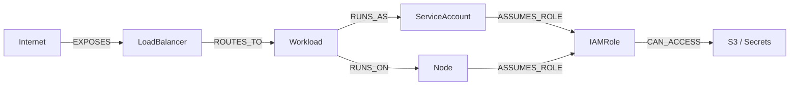

# dp — Graph-based cloud security analysis for Kubernetes and AWS

**Find the real attack paths in your cloud — not 200 isolated findings.**

`dp` builds an asset graph of your Kubernetes cluster and AWS accounts, then walks it to surface the attack paths that actually matter: the ones that go from internet exposure all the way to your cloud data.

[](https://golang.org/)
[](LICENSE)
[](#)

---

## Table of contents

- [What dp looks like](#what-dp-looks-like)
- [Quickstart](#quickstart)
- [Why dp exists](#why-dp-exists)
- [Features](#features)
- [When should I use dp?](#when-should-i-use-dp)
- [CI / automation](#ci--automation)
- [Detected attack patterns](#detected-attack-patterns)
- [JSON output](#json-output)
- [Installation](#installation)
- [Commands reference](#commands-reference)
- [Documentation](#documentation)
- [Contributing](#contributing)
- [Security](#security)
- [License](#license)

---

## What dp looks like

**Kubernetes — attack path ranking:**

```
$ dp kubernetes risk top

TOP ATTACK PATH RISKS

#     SEVERITY    SCORE   ATTACK PATH
1     CRITICAL    130     Internet → kafka-ui → app-role → customer-data
2     HIGH        80      Internet → platform-api → eks-node-role
3     HIGH        70      billing → worker-3 → node-role
```

**Kubernetes — structured explanation of the top risk:**

```
$ dp kubernetes risk explain

AI SECURITY EXPLANATION

Severity: CRITICAL  Score: 130

Attack Path
Internet → kafka-ui → app-role → customer-data

What This Means
The workload "kafka-ui" is exposed to the internet through a LoadBalancer.
It can reach the AWS IAM role "app-role", which in turn grants access to the
cloud resource "customer-data".
This creates a direct path from the public internet to sensitive cloud data.

Why This Is Dangerous
This is a complete data-exfiltration path. An attacker who exploits a
vulnerability in "kafka-ui" can immediately read or write "customer-data"
without any additional lateral movement.

Recommended Actions
• Restrict the service from public internet exposure or add authentication
• Use IRSA to scope IAM credentials to individual workloads, not the whole node
• Apply least-privilege to "app-role" — restrict to the minimum required actions
• Enable server-side access logging on "customer-data" to detect exfiltration
• Run containers with a non-root user and drop all Linux capabilities
```

**AWS — combined security, cost, and data protection audit:**

```
$ dp aws audit --all

Security
• 2 IAM roles allow wildcard actions
• 1 S3 bucket is publicly accessible

Data Protection
• 3 S3 buckets are not encrypted

Cost
• 4 idle EBS volumes detected
• 2 unattached Elastic IPs
```

---

## Quickstart

```bash
# Install
go install github.com/devopsproxy/dp/cmd/dp@latest

# Kubernetes: find and explain the top attack path
dp kubernetes risk top
dp kubernetes risk explain

# Kubernetes: full governance audit
dp kubernetes audit

# AWS: combined cost + security + data protection audit
dp aws audit --all
```

No agents. No SaaS. No API keys required.

---

## Why dp exists

Traditional security scanners produce hundreds of isolated findings. They tell you a container runs as root, a service is public, and an IAM role is over-permissive — but not that those three things together form a complete data-exfiltration path.

`dp` builds an in-memory asset graph from your live cluster inventory and AWS identity data, then walks it to detect toxic combinations:



**One compromised pod + one over-permissive node role + one public service = game over.**
`dp` finds that combination before an attacker does.

---

## Features

**Kubernetes attack path detection**
- Builds an in-memory asset graph from live cluster inventory
- Detects 4 toxic topologies (P1–P4) with additive scoring
- Scores: Internet exposure +40 · Node access +30 · IAM role +40 · Cloud resource +50
- CRITICAL ≥ 100 · HIGH ≥ 70 · MEDIUM ≥ 40

**Risk explanation engine**
- Deterministic plain-English explanation per finding — no LLM required
- Four sections: Attack Path · What This Means · Why This Is Dangerous · Recommended Actions

**Kubernetes governance audit**
- 22 deterministic rules (16 core + 6 EKS)
- Pod Security Standards: privileged, hostNetwork, runAsRoot, capabilities, seccomp
- EKS identity governance: IRSA, OIDC, node role policies, control plane logging
- Risk chain correlation: 6 compound patterns, 5 multi-layer attack paths (scores 90–98)

**AWS audit**
- Cost optimisation: idle EC2, unattached EBS, oversized RDS, NAT gateway waste
- Security posture: IAM wildcard actions, public S3 buckets, unrestricted security groups, MFA gaps
- Data protection: unencrypted RDS, EBS, and S3
- Combined audit via `dp aws audit --all` — cost + security + data protection in one run

**Output modes**
- `--output table` — human-readable, column-aligned (default)
- `--output json` — automation-friendly, no headers, clean schema

**Offline-first**
- Rule engine never calls an external API
- Works in air-gapped clusters and CI pipelines
- Deterministic: same cluster → same findings, every run

---

## When should I use dp?

- **You want to know which findings actually matter** — `dp` scores and ranks attack paths so you fix the critical chain, not 200 individual alerts
- **You suspect a workload can reach cloud data** — `dp` traces the full path from internet exposure through IAM to S3/Secrets Manager
- **You're onboarding a new EKS cluster** — `dp kubernetes audit` runs 22 governance rules and highlights toxic combinations in one command
- **You need AWS security and cost hygiene in CI** — `dp aws audit --all` exits 1 on CRITICAL/HIGH findings; JSON output integrates with any pipeline
- **You want offline, reproducible security checks** — no agents, no SaaS, no API keys; same cluster always produces the same findings

---

## CI / automation

`dp` exits 1 when CRITICAL or HIGH findings are detected, making it safe to use as a pipeline gate.

```bash
# Fail the pipeline if critical attack paths exist
dp kubernetes risk top --output json | jq 'if map(select(.severity == "CRITICAL")) | length > 0 then error else . end'

# Fail on any CRITICAL/HIGH AWS finding
dp aws audit --all --output json

# Structured output for downstream processing
dp kubernetes audit --output json | jq '.findings[] | select(.severity == "CRITICAL")'
```

All JSON output is clean — no banners, no headers, no progress messages mixed into stdout.

---

## Detected attack patterns

| Pattern | Path | Score | Severity |
|---------|------|-------|----------|
| P3 | Internet → LB → Workload → IAMRole → CloudResource | 130 | CRITICAL |
| P2 | Internet → LB → Workload → IAMRole | 80 | HIGH |
| P1 | Internet → LB → Workload → Node | 70 | HIGH |
| P4 | Workload → Node → IAMRole (no internet) | 70 | HIGH |

---

## JSON output

```bash
dp kubernetes risk top --output json
```

```json
[
  {
    "severity": "CRITICAL",
    "score": 130,
    "path": ["Internet", "kafka-ui", "app-role", "customer-data"],
    "explanation": "Public service combined with cloud credentials may allow direct access to cloud data."
  }
]
```

```bash
dp kubernetes risk explain --output json
```

```json
[
  {
    "severity": "CRITICAL",
    "score": 130,
    "path": ["Internet", "kafka-ui", "app-role", "customer-data"],
    "explanation": "Public service combined with cloud credentials may allow direct access to cloud data."
  }
]
```

---

## Installation

**Go install (recommended)**
```bash
go install github.com/devopsproxy/dp/cmd/dp@latest
```

**From source**
```bash
git clone https://github.com/devopsproxy/dp
cd dp
go build -o dp ./cmd/dp
```

**Requirements**
- Go 1.21+
- `kubectl` configured with cluster access
- AWS credentials (optional — only needed for IAM/EKS enrichment)

---

## Commands reference

```
dp kubernetes audit                      # Full governance audit (22 rules)
dp kubernetes audit --show-risk-chains   # Include attack paths + risk chains
dp kubernetes audit --output json        # JSON output for CI

dp kubernetes risk top                   # Top attack path risks (asset graph)
dp kubernetes risk top --top 5           # Limit to 5 results
dp kubernetes risk top --output json

dp kubernetes risk explain               # Explain the top-scored risk
dp kubernetes risk explain --output json

dp aws audit cost                        # AWS cost optimisation
dp aws audit security                    # AWS security posture
dp aws audit dataprotection              # Encryption at rest
dp aws audit --all                       # All AWS domains combined

dp doctor                                # Check AWS + Kubernetes connectivity
dp policy validate --policy dp.yaml      # Validate policy file
```

---

## Documentation

| Document | Contents |
|----------|---------|
| [docs/architecture.md](docs/architecture.md) | Asset graph, scoring model, attack path detection, package layout |
| [docs/kubernetes.md](docs/kubernetes.md) | All 22 Kubernetes rules, risk chains, attack paths |
| [docs/aws.md](docs/aws.md) | AWS cost, security, and data protection rules |
| [docs/policy.md](docs/policy.md) | dp.yaml policy file format |
| [docs/outputs-and-ci.md](docs/outputs-and-ci.md) | JSON output, CI integration, exit codes |
| [docs/security-and-permissions.md](docs/security-and-permissions.md) | Required AWS and Kubernetes RBAC permissions |
| [docs/troubleshooting.md](docs/troubleshooting.md) | Common issues and fixes |

---

## Contributing

Contributions are welcome. Please open an issue to discuss the change before submitting a pull request for significant features. For small fixes, a PR is fine directly.

- Keep the rule engine deterministic — no LLM calls in the detection path
- Add unit tests for any new rules or scoring logic
- Run `go test ./...` and `go build ./...` before submitting

---

## Security

To report a security vulnerability, please do **not** open a public GitHub issue. Instead, email the maintainers directly or use GitHub's private vulnerability reporting feature. We will respond within 72 hours.

---

## License

MIT — see [LICENSE](LICENSE).
