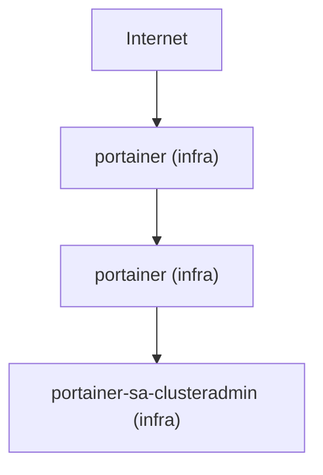

# Kubernetes Audit Reference

`dp kubernetes audit` runs 22 deterministic governance rules against a live Kubernetes cluster (16 core + 6 EKS-specific), correlates findings into risk chains and attack paths, and optionally renders results as a directed graph.

---

## Quick start

```bash
# Audit current kubeconfig context
dp kubernetes audit

# Audit a specific context
dp kubernetes audit --context prod-eks

# JSON output
dp kubernetes audit --output json

# Compact summary
dp kubernetes audit --summary

# Save full JSON report
dp kubernetes audit --file k8s-report.json
```

---

## All flags

| Flag | Type | Default | Description |
|------|------|---------|-------------|
| `--context` | string | `""` | Kubeconfig context (empty = current context) |
| `--output` | string | `table` | Output format: `table` or `json` |
| `--summary` | bool | false | Compact severity breakdown + top-5 findings |
| `--file` | string | `""` | Write full JSON report to file (stdout unchanged) |
| `--policy` | string | `""` | Path to `dp.yaml`; auto-detected if `./dp.yaml` exists |
| `--exclude-system` | bool | false | Drop findings from `kube-system`, `kube-public`, `kube-node-lease` |
| `--min-risk-score` | int | 0 | Only include findings with `risk_chain_score` ≥ this value |
| `--show-risk-chains` | bool | false | Group output by attack path / risk chain; enables path detection |
| `--explain-path` | int | 0 | Print structured breakdown of the attack path with this score (requires `--show-risk-chains`) |
| `--min-attack-score` | int | 0 | Only render attack paths with score ≥ this value (requires `--show-risk-chains`) |
| `--attack-graph` | bool | false | Render attack paths as a directed graph (requires `--show-risk-chains`) |
| `--graph-format` | string | `mermaid` | Graph output format: `mermaid` or `graphviz` |

---

## Core rules (always evaluated)

| Rule ID | Severity | What it detects |
|---------|----------|-----------------|
| `K8S_CLUSTER_SINGLE_NODE` | HIGH | Cluster has only one node — no redundancy |
| `K8S_NODE_OVERALLOCATED` | HIGH | Node CPU/memory requests exceed capacity |
| `K8S_SERVICE_PUBLIC_LOADBALANCER` | HIGH | Service type LoadBalancer exposes workloads externally |
| `K8S_NAMESPACE_WITHOUT_LIMITS` | MEDIUM | Namespace has no LimitRange |
| `K8S_POD_NO_RESOURCE_REQUESTS` | MEDIUM | Pod containers have no CPU/memory requests |
| `K8S_PRIVILEGED_CONTAINER` | CRITICAL | Container running in privileged mode |
| `K8S_POD_PRIVILEGED_CONTAINER` | CRITICAL | Pod-level privileged container (PSS baseline) |
| `K8S_POD_HOST_NETWORK` | HIGH | Pod uses host network namespace |
| `K8S_POD_HOST_PID_OR_IPC` | HIGH | Pod uses host PID or IPC namespace |
| `K8S_POD_RUN_AS_ROOT` | HIGH | Container runs as root (UID 0) |
| `K8S_POD_CAP_SYS_ADMIN` | HIGH | Container adds CAP_SYS_ADMIN capability |
| `K8S_POD_NO_SECCOMP` | MEDIUM | Container has no seccomp profile |
| `K8S_POD_SECURITY_ADMISSION_NOT_ENFORCED` | HIGH | Namespace missing `pod-security.kubernetes.io/enforce` label |
| `K8S_NAMESPACE_PSS_NOT_SET` | MEDIUM | Namespace has no Pod Security Standards label |
| `K8S_SERVICEACCOUNT_TOKEN_AUTOMOUNT` | MEDIUM | ServiceAccount automounts tokens (opt-out not set) |
| `K8S_DEFAULT_SERVICEACCOUNT_USED` | MEDIUM | Workload uses the `default` ServiceAccount |

---

## EKS rules (evaluated when EKS API is reachable)

| Rule ID | Severity | What it detects |
|---------|----------|-----------------|
| `EKS_ENCRYPTION_DISABLED` | CRITICAL | Secrets not encrypted at rest (`EncryptionConfig` empty) |
| `EKS_PUBLIC_ENDPOINT_ENABLED` | HIGH | API server endpoint is publicly accessible |
| `EKS_CONTROL_PLANE_LOGGING_DISABLED` | HIGH | `api`, `audit`, or `authenticator` log types not enabled |
| `EKS_NODE_ROLE_OVERPERMISSIVE` | CRITICAL | Node IAM role has admin/wildcard policies attached |
| `EKS_OIDC_PROVIDER_NOT_ASSOCIATED` | HIGH | Cluster has no OIDC provider (blocks IRSA) |
| `EKS_SERVICEACCOUNT_NO_IRSA` | HIGH | ServiceAccount has no `eks.amazonaws.com/role-arn` annotation |

EKS rule evaluation is silently skipped if the AWS EKS API call fails.

---

## Namespace classification

Every finding carries a `namespace_type` metadata key:

| Value | Meaning |
|-------|---------|
| `"system"` | `kube-system`, `kube-public`, or `kube-node-lease` |
| `"workload"` | Any user namespace |
| `"cluster"` | Cluster-scoped (nodes, EKS control-plane) |

Use `--exclude-system` to suppress system findings in CI:

```bash
dp kubernetes audit --exclude-system --policy ./dp.yaml
```

---

## Risk chains

After rule evaluation, findings are correlated into compound risk chains. Participating findings receive `risk_chain_score` and `risk_chain_reason` metadata keys.

| Score | Chain | Condition |
|-------|-------|-----------|
| **95** | OIDC missing + high workload risk | `EKS_OIDC_PROVIDER_NOT_ASSOCIATED` + any HIGH finding (cluster-wide) |
| **90** | Overpermissive node + public LB | `EKS_NODE_ROLE_OVERPERMISSIVE` + `K8S_SERVICE_PUBLIC_LOADBALANCER` (cluster-wide) |
| **85** | No IRSA + default SA | `EKS_SERVICEACCOUNT_NO_IRSA` + `K8S_DEFAULT_SERVICEACCOUNT_USED` (same namespace) |
| **80** | Public LB + privileged workload | `K8S_SERVICE_PUBLIC_LOADBALANCER` + (`K8S_POD_RUN_AS_ROOT` or `K8S_POD_CAP_SYS_ADMIN`) (same namespace) |
| **60** | Default SA + automount | `K8S_DEFAULT_SERVICEACCOUNT_USED` + `K8S_SERVICEACCOUNT_TOKEN_AUTOMOUNT` (same namespace) |
| **50** | Single-node + critical violation | `K8S_CLUSTER_SINGLE_NODE` + any CRITICAL finding (cluster-wide) |

`summary.risk_score` reflects the highest chain score (or attack path score when paths are detected). It is always computed on the pre-filter, pre-policy set.

Use `--min-risk-score` to restrict output to findings above a threshold:

```bash
dp kubernetes audit --min-risk-score 80
```

---

## Attack paths

When `--show-risk-chains` is enabled, the engine also detects **multi-layer attack paths** — end-to-end attacker journeys through the infrastructure.

| Score | Scope | Path name | Key conditions |
|-------|-------|-----------|----------------|
| **98** | Per-namespace | Exposed privileged workload | Public LB + root/CAP_SYS_ADMIN + weak SA identity |
| **96** | Per-namespace | Cross-cloud IAM escalation | Public LB + privilege + identity weakness + overpermissive node IAM |
| **94** | Cluster | EKS control plane exposure | Public endpoint + weak IAM + logging disabled |
| **92** | Per-namespace | SA token misuse chain | Default SA + automount + no IRSA + no OIDC |
| **90** | Cluster | Cluster governance disabled | Encryption off + logging off + single-node |

`summary.risk_score` is set to the highest attack path score when any path is detected, overriding chain scores.

```bash
# Enable attack path detection
dp kubernetes audit --show-risk-chains

# Filter to only high-severity paths
dp kubernetes audit --show-risk-chains --min-attack-score 95

# JSON — extract risk score
dp kubernetes audit --show-risk-chains --output json | jq '.summary.risk_score'
```

### Example JSON with attack paths

```json
{
  "summary": {
    "risk_score": 96,
    "attack_paths": [
      {
        "score": 96,
        "layers": ["Network Exposure", "Workload Compromise", "Cloud IAM Escalation"],
        "finding_ids": ["K8S_SERVICE_PUBLIC_LOADBALANCER:web-svc", "K8S_POD_RUN_AS_ROOT:web-pod"],
        "description": "Externally reachable workload can assume over-permissive cloud IAM role."
      }
    ]
  }
}
```

Each path's `finding_ids` contains only findings whose primary `rule_id` is in the path's allowed set — no contamination from unrelated findings.

---

## Cloud attack paths

In addition to rule-correlation attack paths (above), `dp` automatically detects **graph-traversal attack paths** — paths derived purely from the asset graph topology, not from rule findings. These are surfaced as `CRITICAL ATTACK PATH` in the output and populate `summary.cloud_attack_paths` in JSON.

Unlike rule-correlation paths, cloud attack paths are **always computed** when the asset graph is built — they are not gated on `--show-risk-chains`.

### What is detected

Every path of the form:

```
Internet → LoadBalancer → Workload → [Node or ServiceAccount] → IAMRole → Sensitive Cloud Resource
```

where the cloud resource has `sensitivity = "high"`. Both identity chains are followed:

| Identity chain | Edge path |
|---------------|-----------|
| **IRSA** | Workload → ServiceAccount → IAMRole |
| **Instance profile** | Workload → Node → IAMRole |
| **Cross-role escalation** | IAMRole_A → IAMRole_B (sts:AssumeRole) |

### Example output

```
ATTACK PATH SUMMARY

  CRITICAL: 1

CRITICAL ATTACK PATH (Score: 110)

Internet
 → LoadBalancer_kafka-ui
 → Deployment_platform-api
 → Node_ip-10-0-1-1
 → IAMRole_node-role
 → IAMRole_admin-role
 → S3Bucket_customer-data [SENSITIVE]

Explanation: Traffic enters from the Internet. ...
```

### Scoring

| Criterion | Score |
|-----------|-------|
| Internet node in path | +40 |
| Workload node in path | +20 |
| IAMRole node in path | +20 |
| High-sensitivity cloud resource | +20 |
| ≥2 IAMRole nodes (cross-role escalation) | +10 |
| **Maximum** | **110** |

### Attack path prioritization

Each cloud attack path carries a **severity** classification and a `HasSensitiveData` flag:

| Score range | Severity |
|-------------|----------|
| ≥ 90 | CRITICAL |
| 70 – 89 | HIGH |
| < 70 | MEDIUM |

Paths are sorted CRITICAL first, then by descending score, then by ascending path length (shorter = more direct = higher priority). The `[SENSITIVE]` marker appears on the target node when the cloud resource has `sensitivity = "high"`.

### JSON output

```json
"cloud_attack_paths": [
  {
    "score": 110,
    "severity": "CRITICAL",
    "has_sensitive_data": true,
    "source": "Internet",
    "target": "S3Bucket_customer-data",
    "nodes": [
      "Internet",
      "LoadBalancer_kafka-ui",
      "Deployment_platform-api",
      "Node_ip-10-0-1-1",
      "IAMRole_node-role",
      "IAMRole_admin-role",
      "S3Bucket_customer-data"
    ]
  }
]
```

---

## Explain attack path

Use `--explain-path <score>` to print a structured breakdown of one attack path. Requires `--show-risk-chains`.

```bash
dp kubernetes audit --show-risk-chains --explain-path 96
dp kubernetes audit --show-risk-chains --explain-path 96 --output json
dp kubernetes audit --show-risk-chains --explain-path 123  # prints "not found"
dp kubernetes audit --explain-path 96  # error: requires --show-risk-chains
```

Example table output:

```
ATTACK PATH (Score: 96)
Description: Externally reachable workload can assume over-permissive cloud IAM role (cross-plane privilege escalation).
Layers: Network Exposure → Workload Compromise → Cloud IAM Escalation

Findings (4):

  ✓ EKS_NODE_ROLE_OVERPERMISSIVE
    - my-cluster

  ✓ EKS_SERVICEACCOUNT_NO_IRSA
    - default (prod)

  ✓ K8S_POD_RUN_AS_ROOT
    - web-pod (prod)

  ✓ K8S_SERVICE_PUBLIC_LOADBALANCER
    - web-svc (prod)
```

Example JSON output:

```json
{
  "attack_path": {
    "score": 96,
    "layers": ["Network Exposure", "Workload Compromise", "Cloud IAM Escalation"],
    "finding_ids": ["..."],
    "description": "Externally reachable workload can assume over-permissive cloud IAM role."
  }
}
```

In explain mode, the normal audit table, policy enforcement, and exit-code-1 logic are skipped — the command exits 0.

---

## Attack path graph visualization

Use `--attack-graph` to render the attack path as a directed graph. Requires `--show-risk-chains`. Normal table output and policy enforcement are skipped.

```bash
# Mermaid (default)
dp kubernetes audit --show-risk-chains --attack-graph

# Graphviz DOT
dp kubernetes audit --show-risk-chains --attack-graph --graph-format graphviz

# Save Mermaid to file
dp kubernetes audit --show-risk-chains --attack-graph > attack-graph.mmd

# Render as SVG
dp kubernetes audit --show-risk-chains --attack-graph --graph-format graphviz | dot -Tsvg > out.svg

# Combine with filters
dp kubernetes audit --show-risk-chains --exclude-system --min-attack-score 95 --attack-graph
```

### Node hierarchy

```
Internet → LoadBalancer → Workload (Deployment/StatefulSet/…) → ServiceAccount → IAMRole
```

Every edge reflects a real Kubernetes relationship:
- **Internet → LoadBalancer**: every Service of type LoadBalancer
- **LoadBalancer → Workload**: Service `spec.selector` matches pod `metadata.labels`
- **Workload → ServiceAccount**: `pod.spec.serviceAccountName` match in the same namespace
- **ServiceAccount → IAMRole**: `eks.amazonaws.com/role-arn` IRSA annotation (Phase 11)

**Pods are not nodes.** Each pod is collapsed into its parent workload via `ownerReferences` (Pod → ReplicaSet → Deployment). Multiple replicas of the same Deployment produce a single `Deployment_*` node.

Nodes with no confirmed structural partner still appear as context — a node without an edge means the relationship can't be confirmed from available data, not that no risk exists.

### Example Mermaid output



---

## `dp kubernetes inspect`

A lightweight context check — does not run audit rules.

```bash
dp kubernetes inspect
dp kubernetes inspect --context my-cluster
```

Output:

```
Context:     prod-eks
API Server:  https://ABCD1234.gr7.us-east-1.eks.amazonaws.com
Nodes:       6
Namespaces:  12
```

---

## See also

- [Policy file reference](policy.md)
- [Output modes and CI](outputs-and-ci.md)
- [Required Kubernetes RBAC](security-and-permissions.md#kubernetes-rbac)
- [Architecture](architecture.md)
